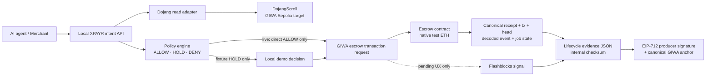

# XPAYR Verified AgentPay for GIWA

XPAYR Verified AgentPay is an isolated testnet MVP for policy-controlled AI-agent jobs that target GIWA Sepolia. It combines an XPAYR `ALLOW` / `HOLD` / `DENY` decision, mandatory contract-level Dojang Verified Address checks, a non-custodial escrow state machine, independent canonical-receipt verification, signed policy-origin evidence, and an optional producer-signed/on-chain-anchored evidence sidecar.

> Status: isolated MVP with positive D1, one D2 deployment, Blockscout source-visible verification at the expected `PARTIAL` level for a no-CBOR build, two historical checksum-only D3 records, two historical same-EOA signed-policy/auth-v1 records, and a fresh Phase 4 release/refund pair under the separated `phase4_sod_v1` authority profile. Both Phase 4 lifecycles have producer-signed, canonically anchored auth-v2 `XPA2` sidecars with `overall_authenticated=true`. Target network: `giwa-testnet` (chain ID `91342`). Demo asset: native test ETH only. No Mainnet deployment, production service, real customer funds, stablecoin support, KYC/AML decision, automatic evaluator release, independent audit, public repository/demo publication, GASOK submission, or GIWA/Upbit endorsement is claimed.

The checked-in deployment state is `deployed_testnet`. Positive D1 evidence binds payer/deployer `0xB209dd7408FFD12A8575a429be946DeD5FbaD732` and provider `0x065b8EbeC5a59ef6324138Ecf21D630AE4137152` at canonical block `31153475`. The escrow is deployed at `0x7b0630cBb92be8E11512cb331b8D1aef94cEEc53`, and separate bounded native-test-ETH jobs produced canonical `RELEASED` and `REFUNDED` terminal evidence. `xpayr.up.id` and `mbo.up.id` are retained only as human-readable labels; they are not authentication or authorization proof.

## Why this is GIWA-native

This is not an EVM network-row exercise. The intended product depends on GIWA-specific primitives:

- Dojang Verified Address is a mandatory contract-level identity signal for payer, provider, and any configured evaluator. It cannot be disabled per job.
- GIWA Sepolia is the chain on which the escrow lifecycle is intended to execute.
- Flashblocks can improve the perceived pending experience, but never decides completion.
- A wallet-ready action model exposes pending jobs, approval, release, dispute, refund, and evidence.
- `up.id`, Verified Code, account abstraction, and paymaster support are explicitly future extensions; they are not implemented or claimed by this MVP.

The GIWA implementation lives in this isolated directory. Arc contracts, transaction hashes, fixtures, and evidence are not accepted as proof of GIWA behavior.

## Product flow

1. A merchant creates an AI job or payment request.
2. Payer, provider, and—when policy requires it—evaluator addresses are checked through the Dojang adapter.
3. An AI agent sends a normalized payment intent to the local XPAYR API.
4. The policy engine returns exactly one decision: `ALLOW`, `HOLD`, or `DENY`.
5. Only an authorized intent may be bound to an escrow request. XPAYR derives a trusted per-record `jobNonce`; callers cannot supply `jobId` or `jobNonce`. The contract requires `jobId == keccak256(abi.encode(payer, jobNonce))` for `msg.sender`, preventing another payer from preempting the binding. In `live_wallet` mode the bridge accepts only a direct policy `ALLOW`; unauthenticated local `approve` and `reject` actions fail with HTTP `403`. Address-only `HOLD` approval remains available only in the visibly labeled fixture flow and cannot prove authority for a real chain action.
6. The policy-bound expected amount and expiry are included in job creation, and the payer must fund exactly that native-test-ETH amount.
7. The provider commits a deliverable hash; no private deliverable content is stored on-chain.
8. A human merchant/evaluator approves, releases, disputes, or follows the refund path.
9. XPAYR treats Flashblocks as an observed/pending signal. Terminal confirmation independently re-fetches the receipt, transaction, canonical receipt block, and chain head; recognizes `releaseJob`, `resolveDispute`, `claimRefund`, or `claimDisputeTimeoutRefund` calldata; validates the outcome-specific `JobReleased`, `JobRefunded`, and when applicable `DisputeResolved` events; and reads the on-chain job state before accepting the role, amount, policy, expiry, and verification bindings. A verified refund is terminal with `refunded=true` but never payment completion (`completed=false`).
10. XPAYR exports the available facts in a GIWA-only lifecycle evidence JSON with a deterministic internal checksum. An EIP-712-signed XPAYR policy artifact is verified before signer access. Historical auth-v1 sidecars bind the same-EOA lifecycle/policy/file proof to `XPA1`; Phase 4 auth-v2 sidecars additionally bind the sealed authority-profile digest, distinct policy authority, distinct evidence producer, exact lifecycle/policy digests, producer signature, and canonical zero-value `XPA2` anchor.

The checksum alone supports reproducibility and detects accidental or out-of-sync mutation relative to a separately trusted copy; anyone who edits the payload can recompute it. Auth-v1 and auth-v2 sidecars add explicitly scoped EOA-control proof for their exact signed and anchored bindings. Auth-v2 proves cryptographic role separation between the configured policy-authority and evidence-producer EOAs; it still does not prove XPAYR legal identity, separate organizations, independent human review, legal non-repudiation, or production key governance.

## Architecture



Trust boundaries are deliberate:

- XPAYR evaluates and records policy; it does not custody pooled funds.
- Dojang is a read-only identity signal, not an XPAYR KYC or credit decision.
- The browser is presentation and signing UX, not a payment-completion authority.
- Canonical receipt/transaction/head, decoded-event, and on-chain-state verification is separate from Flashblocks observation and independently re-fetched from the standard RPC.
- Evidence records what was checked; it cannot make an incorrect upstream fact true.
- The local address-only approval route exists only in fixture mode. Live mode rejects unauthenticated local approval/rejection and requires direct `ALLOW` before transaction construction.
- A prepared wallet transaction is an immutable decoded preview bound to the active intent/job context. Changing the account, chain, intent, or runtime contract invalidates that context before send.

## State machine

Primary success path:

```text
CREATED -> FUNDED -> SUBMITTED -> APPROVED -> RELEASED
```

Terminal alternatives:

```text
CREATED -> CANCELLED
CREATED -> EXPIRED -> REFUNDED
FUNDED -> CANCELLED -> REFUNDED
FUNDED -> EXPIRED -> REFUNDED
SUBMITTED -> EXPIRED -> REFUNDED
SUBMITTED -> DISPUTED -> RELEASED
SUBMITTED -> DISPUTED -> REFUNDED
APPROVED -> DISPUTED -> RELEASED
APPROVED -> DISPUTED -> REFUNDED
```

Every state transition must be role-authorized and emitted as an event. A job cannot be funded, released, or refunded twice. The evaluator never releases funds merely because an AI model says the work is valid.

## Local API contract

The prototype API is local-only and is not a production authentication boundary.

| Method | Route | Purpose |
|---|---|---|
| `GET` | `/api/health` | Local service and configured network status |
| `GET` | `/api/config` | Public, secret-free demo configuration |
| `GET` | `/api/reviewer-proof` | Return the sealed retained reviewer-index view; query overrides are forbidden |
| `GET` | `/api/dojang/:address` | Read-only normalized Dojang verification result |
| `GET` | `/api/intents` | List in-memory demo intents |
| `POST` | `/api/intents` | Normalize an intent and produce `ALLOW`, `HOLD`, or `DENY` |
| `GET` | `/api/intents/:id` | Read one intent, approval, execution, and confirmation record |
| `POST` | `/api/intents/:id/approve` | Fixture only: record an address-labeled local approval for a held intent; live mode returns `403` |
| `POST` | `/api/intents/:id/reject` | Fixture only: reject an intent before transaction construction; live mode returns `403` |
| `POST` | `/api/intents/:id/bridge` | Produce the escrow transaction request; live mode requires an unmodified direct `ALLOW` |
| `POST` | `/api/intents/:id/confirmations/wallet-submitted` | Record the exact participant-wallet transaction hash immediately in the in-memory intent for browser-reload recovery; not completion proof |
| `POST` | `/api/intents/:id/confirmations/flashblocks` | Record a validated, non-terminal pending observation |
| `POST` | `/api/intents/:id/confirmations/canonical` | Independently verify canonical receipt, transaction, head, decoded event, and on-chain job state |
| `GET` | `/api/intents/:id/evidence` | Return the intent's evidence JSON view and internal checksum |

`bridge` means “bind the approved intent to the GIWA escrow call.” It does **not** mean a cross-chain bridge.

Write requests use JSON except the bodyless `bridge` action. Exact request/response examples should be taken from the running local service and tests; no response is evidence of a terminal outcome until it is reconciled with canonical transaction/receipt/block/head data, recognized terminal calldata, outcome-specific events, and matching on-chain job state.

Minimal fixture-mode intent example:

```json
{
  "title": "Review an AI-generated catalog",
  "network_key": "giwa-testnet",
  "payer": "0x1111111111111111111111111111111111111111",
  "provider": "0x2222222222222222222222222222222222222222",
  "evaluator": "0x3333333333333333333333333333333333333333",
  "asset": "ETH",
  "amountEth": "0.01",
  "requireApproval": true
}
```

The service obtains identity results from its configured Dojang client. A caller-supplied `identity` or `verification` verdict is rejected. Fixture mode accepts address-labeled approval/rejection solely to exercise local state rules; these strings do not authenticate wallet ownership. `live_wallet` mode exposes neither local decision as authority: both routes return `403`, and `bridge` fails closed unless the policy engine produced direct `ALLOW` without a manual override.

## Network and confirmation rules

The checked-in manifest is the source for the prototype’s public network configuration. The important invariants are:

- network key: `giwa-testnet`;
- expected chain ID: `91342`;
- demo asset: native test ETH;
- standard GIWA Sepolia RPC: chain reads and terminal receipt verification;
- Flashblocks RPC: observed/pending user feedback only;
- Dojang contract and exactly two accepted attester IDs are constructor-bound: distinct immutable `UPBIT_KOREA` and `TESTNET_FAUCET` identifiers, never supplied by an untrusted request;
- Dojang verification is mandatory in the contract for payer, provider, and any configured evaluator; there is no legacy `verificationRequired=false` mode;
- each job binds `expectedAmount`, `expiresAt`, and `policyDecisionHash`; funding must equal `expectedAmount` exactly;
- `jobNonce` is XPAYR-derived rather than caller-supplied, `jobId` is derived from payer plus nonce, and the contract recomputes that binding from `msg.sender` at creation;
- canonical confirmation first queries live `eth_chainId` and fails closed unless it is `91342`; then independently re-fetches receipt, transaction, canonical receipt block, and head; decodes the terminal action plus outcome-specific `JobReleased`/`JobRefunded`/`DisputeResolved` events; reads the job from the deployed contract; and rejects any mismatch in job, outcome, policy, roles, amount, expiry, or required verification;
- `RELEASED` is payment completion; `REFUNDED` is a valid terminal recovery outcome but must preserve `completed=false` and `refunded=true`;
- both the canonical verifier and Dojang adapter query live `eth_chainId` and fail closed unless it is `91342`; Dojang retains `observed_chain_id` with the block number/hash;
- wrong chain, missing code, aggregate Dojang `isVerified=false`/unknown, unpinned or malformed reads, or ambiguous receipt: fail closed;
- the contract and lifecycle adapter use the block-hash-pinned aggregate `isVerified` result as their authorization signal;
- the dedicated D1 recorder additionally resolves each positive UID and validates its EAS recipient, schema UID, official on-chain attester, revocation time, expiration, issue time, and decoded `bool=true` at the same pinned block. A negative aggregate result has no attestation metadata and must not be reported as positive identity proof.

## Running locally

Use Node.js 22 or later and Foundry. The project is intentionally isolated from the root XPAYR package.

```bash
cd giwa-agentpay
npm test
forge test
npm run preflight
npm run serve
```

Open the localhost URL printed by the server. Never place a private key in the browser, source tree, evidence JSON, screenshots, or logs. The retained GIWA Sepolia run used separately approved test-only signers from a repository-external `0600` file and bounded native test ETH; local UI completion by itself still does not imply a chain action.

The default server uses the live Dojang adapter and keeps server-side chain writes and transaction signing disabled. Only an exact reviewed chain, account role, escrow address, runtime bytecode and bounded fee/value/gas envelope can reach the participant-wallet preview. Preview and send are separate actions; after a wallet returns a terminal transaction hash, the service records that exact hash in its in-memory intent before Flashblocks observation so a browser reload in the same server process can resume canonical verification. This is not durable recovery across a server restart. For a deterministic local presentation, start the visibly labeled fixture mode instead:

```bash
GIWA_AGENTPAY_DEMO_FIXTURE=1 npm run serve
```

Fixture responses are local evidence only and must never be represented as live Dojang attestations.

The execution-phase entry points are `npm run preflight:d1`, `npm run preflight:deploy`, `npm run preflight:policy`, `npm run preflight:lifecycle`, and `npm run preflight:authenticate`; see [GIWA Sepolia D1/D2/D3 Execution Runbook](GIWA_SEPOLIA_EXECUTION_RUNBOOK.md). All preflight commands are read-only and do not load signer material. Execute mode can load keys only from an absolute path outside the entire `xpayr.com` repository, using a current-user-owned, non-symlink/non-hard-linked regular file with exact `0600` permissions through `GIWA_AGENTPAY_ENV_FILE`. Real paths, supported/required variables, duplicate assignments, and ambient signer collisions are checked before values are applied; private keys must never be pasted into chat or committed.

`npm run preflight:deploy` remains read-only by default. The completed D2 run passed the exact chain/network, address, positive-D1, cost-cap, signer-binding, canonical-receipt, immutable-getter, and immutable-aware runtime-bytecode gates. Its completed recovery journal is retained as evidence; it is not an active lock. The deployment evidence records gas used `1,709,085`, actual gas cost `1,709,513,980,335 wei`, and the successful transaction/block bindings. Blockscout source verification is complete at the source-visible `PARTIAL` level: submission GUID `7b0630cbb92be8e11512cb331b8D1aef94ceec536a5d5b82`, status `Pass - Verified`, `is_verified=true`, `is_partially_verified=true`, `is_fully_verified=false`, and explorer/local source SHA-256 equality `4ff7ce24715191f79772ecaed517a39e24a0dadc90695be38bdaec809f9dec09`. This level is expected because the deployed compiler settings are `bytecodeHash=none` and `appendCBOR=false`; the exact `7,967`-byte creation input independently matches local bytecode plus constructor arguments with SHA-256 `36bb86676e4f148342e23177c205bda68bf70b595b48c1a2ad021d0a288ece37`. A `FULL` label for this immutable address is unavailable without a CBOR-enabled new deployment, which was neither required nor performed. Source visibility improves reviewability but does not replace runtime or receipt verification.

D3 revalidates the recorded deployment and independently reconstructs the recorded D1 artifact at its retained block, performs fresh aggregate Dojang reads, rejects zero roles/nonces, binds the exact release deliverable hash (and requires zero for refund), and serializes all lifecycle executions behind one private global lock. The current path accepts a signed policy artifact whose EIP-712 signer, `ALLOW` decision, validity window, record/intent IDs, chain, escrow, payer/provider/evaluator, job ID/nonce, outcome, amount, expiry, and deliverable hash are all checked before signer access and again at the pre-broadcast freshness gate. Explicit `--resume --execute` recovery keeps signature and exact journal binding checks while permitting an expired policy only to finish an already-started canonical journal safely. The two original 2026-07-19 D3 files remain unchanged and correctly retain `not_provided_cli_hash_only`; they are historical evidence, not silently upgraded. The two newer signed-policy runs and their auth-v1 sidecars have no active lifecycle/authentication lock or lease.

## Phase 4 live separated-authority checkpoint — complete

- The sealed `phase4_sod_v1` authority profile is `active` with canonical digest `0x766385f57fa89d679c5c8fc0222f5b765baceeb9899707b5fafe8df3fc881187`.
- Policy authority `0x89128251A3B46328Dc89A13B58C1339217B2fD34` and evidence producer `0x79E5c4591691a8369CE4537c25cF1aa3DDe65b45` are distinct from one another and from the retained payer/provider/deployer roles. Participant and authority signer files remained repository-external with exact `0600` permissions; private values and serialized signed transactions were not persisted in source, evidence, logs, or the reviewer bundle.
- Phase 4 release: job `0x9df3f7d659991dfa95ac7ca89e4c531b09a497d65070cd4856db4a9f51eac740`, lifecycle digest `0x9558da912bcba7998a65585aeaa61f2b11edd1e45bbfdbb42386f090542f1fbc`, canonical `5/5` lifecycle, terminal [`RELEASED` transaction `0x66695b08…c92e`](https://sepolia-explorer.giwa.io/tx/0x66695b08f17e9be7838ec1ab1cb08bb25259e0a9dc496ee1dc1070eca554c92e), `payment_completed=true`.
- Phase 4 refund: job `0x774f6daa21eb143b12f03e964b21ec5863f509f5f96b0f4b6ace50675204cff6`, lifecycle digest `0x04a6552104ef92927ed7327669aa20f060672036cd3a3e2d794cdd13e938447e`, canonical `4/4` lifecycle, terminal [`REFUNDED` transaction `0x3f58ca24…6355`](https://sepolia-explorer.giwa.io/tx/0x3f58ca24da8c6f5a729212207feeb14514dbb624be6ddd21e2189230137d6355), `payment_completed=false`, `refunded=true`.
- Phase 4 auth-v2: the release sidecar has digest `0xc845c36b59294271b91ac5cf4780e4f276aa362fe7ad7f0e61c0cec571e7ded7` and canonical [`XPA2` anchor `0x4463689c…8ba9`](https://sepolia-explorer.giwa.io/tx/0x4463689c212a93a679e8f3ce1209d2d86d1f522a6798bc6de151a63174558ba9); the refund sidecar has digest `0xffd002fbc16b56752559a2483c7bacd5766fffc2ad53a61f7e0db8774053a1d4` and canonical [`XPA2` anchor `0x8696c471…7650`](https://sepolia-explorer.giwa.io/tx/0x8696c471adf870f2268515537c7be7f6989e8c5011c38256e846b56278807650). Both retain `overall_authenticated=true`, exact policy/lifecycle/profile bindings, verified producer signatures, canonical self-transactions, and zero value.
- The historical signed-policy D3/auth-v1 release and refund remain valid retained evidence, but they used the historical same-EOA authority model. Activating the new profile does not retroactively upgrade those artifacts.
- Resume now treats a missing pre-create job as `Status.NONE` only when pinned RPC revert bytes exactly equal `JobNotFound(exactJobId)` and the journal is either an exact zero-step `ready_before_first_broadcast` state with no pending transaction or a validated prepared-create rebroadcast state. Wrong job IDs, trailing bytes, missing/malformed revert data, inconsistent zero-step statuses, `JobNotFound` after any completed step, pinned-head changes, nonce divergence, and concurrent lease ownership fail closed without a blind duplicate broadcast; the matching pre-create case is covered as the positive cleanup path.
- The live-wallet browser smoke is deterministic instrumentation, not a wallet transaction: its EIP-1193 stub produces direct `ALLOW`, prepares and decodes a bounded `createJob` preview, then cancels it with `eth_sendTransaction` count `0`. It proves the local preview/context gates, not wallet ownership, broadcast, receipt, Dojang attestation, or a new G3 result.
- Reviewer-package verification now binds the packaged allowlist itself to manifest metadata, boundaries, limits and the exact file set; recomputed-manifest additions, unsafe secret placeholders, and destructive replacement of unrelated output fail closed.
- Current validation passes the full Node suite `221/221` and focused lifecycle hardening `47/47`, including the exact `JobNotFound` recovery regressions above. The retained Foundry result is `36/36` and the production dependency audit reported vulnerabilities `0`. Both fixture/live-wallet browser smokes report console/page/request/HTTP errors `0` and horizontal overflow `0`; the live-wallet smoke also verifies keyboard preview cancellation/focus restoration and `eth_sendTransaction=0`.
- The exact checked-in `81`-file reviewer allowlist includes the Phase 4 policies, lifecycle files, auth-v2 sidecars, bounded funding evidence, reviewer index, and lifecycle/reviewer tests. The generated package was rebuilt and independently verified after the final documentation update; its checked-in manifest is authoritative for the final digest and byte count. Publication and GASOK submission remain separately gated.

## Retained verification snapshot — 2026-07-20 prior evidence closure

- Solidity escrow: `36/36` Foundry tests pass.
- Solidity compiler parity: Foundry and solc-js both `0.8.30`; optimizer enabled with `200` runs; EVM `paris`; metadata `bytecodeHash=none`, `appendCBOR=false`; compiler warnings `0`; ABI entries `54`; creation/runtime bytecode `7,871/7,527` bytes.
- Contract source SHA-256: `4ff7ce24715191f79772ecaed517a39e24a0dadc90695be38bdaec809f9dec09`.
- Contract artifact SHA-256: `4e89c6db0e9cf3bff175ffd0ec3e97206c72f8096e5bec549eaa10b800bcaed3`.
- Offline preflight: `31/31` pass.
- Live read-only preflight: `36/36` pass at chain `91342`; canonical/Flashblocks heads `31164630/31164630` at the final rerun snapshot, Dojang/EAS/escrow code present, deployment `deployed_testnet`.
- Node `24.14.0` full suite: `184/184` pass, `0` fail/skip/todo. Focused policy/lifecycle/authentication suites: `55/55` (`5` policy, `40` lifecycle, `10` auth); the sealed reviewer-index reconciliation test is separately `1/1`. This includes signed-policy tamper/expiry/binding gates, retained-block D1 reconstruction, forged-artifact rejection, secure secret-file checks, immutable-aware D2 verification, exact D3 deliverable binding, canonical per-step verification, strict-prefix/idempotent resume, prepared-transaction pending/canonical/same-hash recovery, retained gas/fee-cap enforcement, stale-state/reorg failure handling, exact nonce continuity, producer-signature recovery, strict policy-origin authentication, and exclusive lock/lease behavior.
- Positive D1: `evidence/d1/giwa-sepolia-d1-xpayr-mbo-20260719T220311Z.json`; canonical block `31153475`, block hash `0xc89cddeed490aaf8e95b099d6677f4c3b72bf24dcfa1898224871e60cfe1a624`, digest and on-chain reconstruction digest `0x3f15cacd2a712f419d8fb220d6840bfe484504df5d0278a8e57da7a58020fe9c`; payer/provider both verified through the official `TESTNET_FAUCET` attester.
- D2: contract `0x7b0630cBb92be8E11512cb331b8D1aef94cEEc53`; deployment transaction `0x1fda4860da932d6beab0bedd10046d4dc01a21908c5a2ce969a197bce0006908`; block `31153615`; runtime code and immutable-aware runtime bytecode verified; Blockscout source-visible verification is `PARTIAL` as expected for the no-CBOR deployment. Evidence: `evidence/deployment/giwa-testnet-deployment-20260719220537.json`, `evidence/deployment/giwa-testnet-source-verification-20260719T231930Z.json`, and `evidence/deployment/giwa-testnet-source-verification-level-recheck-20260720T005420Z.json`.
- Historical D3 pair: the original release (`0x44a2…209c`, digest `0x38a655…cc49`) and refund (`0x9c93…b925`, digest `0xec8a4d…743b`) remain unchanged with CLI-hash-only policy origin and no producer authentication.
- Signed-policy D3 release: job `0xa3e3f4a98d9a6c28c6be6f42159eb8950c347b5ca520636cf16c99e6ed6cd0a9`; terminal transaction `0xacc9adae988c5094459dec4ff097b4641b608de03a6f0ab820367a6521c87ce2`; `payment_completed=true`; lifecycle digest `0x80fb1c283d09476bf8caa78c097af17666e9f275688a8b9e628122a3c276b903`.
- Signed-policy D3 refund: job `0x5f7f7075eac19ed40139af4de22d905d34f67303a8d7564599ea86c480dcbaf5`; terminal transaction `0x12b65cd22071206fc9a0bfdf62efad91a1eee526fb83cb21dfa0f8fb99104fa6`; `payment_completed=false`, `refunded=true`; lifecycle digest `0x306e041fa5ad2ee337dccc84fe86f3f3973e940d6a1dae410b725a0c932374a3`.
- Auth-v1 closure: release sidecar `evidence/authenticated/signed-release-1784505313296.auth-v1.json`, anchor `0x6e1cbe55b2a964388339a1f2912953707a0881c289e2579c92f384384909da5d`; refund sidecar `evidence/authenticated/signed-refund-1784505313307.auth-v1.json`, anchor `0xbef25cd50a0d5582718a20b818bba43acd587ea69758005689362b2fc82f2be3`. Both report verified producer signature, verified canonical anchor, and `overall_authenticated=true`.
- Retained fixture UI smoke: `HOLD` decision; desktop `1440x1100` and mobile `390x844`; horizontal overflow `0` on both; console errors `0`; page errors `0`; request failures `0`; HTTP responses `>=400` `0`. Post-approval `READY` remains labeled as a local intent with no chain job, repeat approval is disabled, chain controls remain disabled, and downloaded evidence preserves the local-only boundary. Screenshots: `artifacts/ui/agentpay-desktop.png` and `artifacts/ui/agentpay-mobile.png`. These values describe the earlier fixture snapshot, not the Phase 4 live-wallet stub.
- Final local demo video: `artifacts/demo/xpayr-giwa-agentpay-local-fixture.mp4`; captioned silent local fixture; H.264 video-only with exactly one video stream and no audio; `1280x720`; `25` fps; `125.960` seconds; `2,069,692` bytes; SHA-256 `3d80fda5ee8064abd499b1a5d8fa27739f8217aa33d84b7bfa3a298531a6f1e5`. It decodes cleanly and three sampled frames were visually checked. It is not wallet, transaction, fund, deployment, Dojang, or chain proof.
- Regenerated local evidence: `evidence/local-domain-demo.json`; verifier `valid=true`, `producer_authenticated=false`, `non_repudiation=false`; class `local_domain_demo_not_chain_proof`; `overall_pass=false`; transaction hash null; fixture lifecycle/expiry/revocation metadata `not_applicable`; internal digest `0x7f21b84c7f592d52b65a502aed4b18b0af56b6671bc341924f37b5ca466e67ba`; file SHA-256 `74d53739e635a6dceac90089a0298a55c3699cd558584c7c8e34a516329b461f`; signature/anchor null.
- Target-chain evidence reached positive Dojang `D1`, source-visible `PARTIAL` no-CBOR deployment `G2` with independent exact creation/runtime proof, and both signed-policy release/refund lifecycle `G3` outcomes with auth-v1 overlays. Completed journals are retained; no active lifecycle or authentication lock/lease remains. Escrow balance was `0` at both terminal reconciliations.
- Current reviewer entry point, resealed after the Phase 4 evidence update: `evidence/giwa-sepolia-reviewer-index-20260720.json`, canonical payload digest `0x30e5f155ac7b4caeee4a8b149ff653f9c4b82b220b777c09a6344f4cf99e2be5`.
- Demo/publication: script and verified local video artifact exist; no public repository/publication or GASOK submission.

See [TEST_REPORT.md](TEST_REPORT.md) for evidence levels, retained gaps, paths, and the final reconciliation boundary.

## Evidence levels

Keep these labels visible in reports and demos:

| Level | What it proves | What it does not prove |
|---|---|---|
| Local domain test | Policy, state, checksum reproducibility, and guard behavior in the test process | GIWA execution, wallet authentication, producer authenticity, or live Dojang status |
| Local EVM test | Contract bytecode behavior in a local EVM | GIWA Sepolia deployment |
| GIWA RPC preflight | The configured endpoint reports the expected chain and code | A successful escrow transaction |
| GIWA Sepolia receipt | A transaction succeeded with the expected contract events | Live identity unless the Dojang read is independently captured |
| Positive live Dojang read | The configured Dojang contract returned aggregate `isVerified=true` and the D1 recorder validated the corresponding UID/EAS metadata against the official same-block attester registry | Wallet control, KYC/AML, creditworthiness, legal identity, or delivery quality |
| Signed XPAYR policy | The configured policy-authority EOA signed an exact `ALLOW` decision and job binding within its validity window | Independent review, organizational identity, or safe policy design |
| Auth-v1 lifecycle sidecar | The configured producer EOA signed the exact lifecycle/policy/file binding and a canonical GIWA self-transaction anchored that binding | Legal non-repudiation, independent attestation, XPAYR corporate identity, or separation of duties |
| Auth-v2 lifecycle sidecar | A profile-bound, distinct evidence-producer EOA signed the exact lifecycle/policy/profile binding and canonically anchored `XPA2` on GIWA Sepolia | Separate organizations, independent human review, legal identity, legal non-repudiation, or production custody/governance |

The local intent/session envelope uses `xpayr.giwa.verified-agentpay.evidence.v1`. Operational artifacts are separate: positive identity uses `xpayr.giwa.dojang-d1-evidence.v1`, deployment uses `xpayr.giwa.agentpay.deployment-evidence.v1`, signed policy uses `xpayr.giwa.agentpay.policy-evidence.v1`, release/refund uses `xpayr.giwa.agentpay.lifecycle-evidence.v1`, and producer authentication uses `xpayr.giwa.agentpay.lifecycle-evidence-authentication.v1` or `.v2`. D2 retains the validated D1 path/digest and canonical deployment facts; D3 revalidates that reference, retains fresh aggregate Dojang reads, and records canonical terminal state. A checksum alone is not authenticity proof; only explicitly verified signature/anchor records add EOA-control evidence. An Arc address, transaction, receipt, or artifact cannot satisfy a required GIWA check.

## Repository map

```text
contracts/       GIWA escrow source
config/          GIWA Sepolia manifest and deployment state
src/             policy, identity, intent, confirmation, evidence, and server modules
public/          wallet-ready local demo
test/            Solidity tests
tests/           Node.js domain and API tests
scripts/         compile, preflight, deploy, and evidence helpers
artifacts/       generated local contract artifacts
evidence/        generated test-only evidence outputs
```

## Documentation

- [Threat model](THREAT_MODEL.md)
- [Security policy and operational boundaries](SECURITY.md)
- [GASOK application draft](GASOK_APPLICATION_DRAFT.md)
- [2–3 minute demo script](DEMO_SCRIPT.md)
- [Test and evidence report](TEST_REPORT.md)
- [GIWA Sepolia D1/D2/D3 execution runbook](GIWA_SEPOLIA_EXECUTION_RUNBOOK.md)

## License and program status

This directory is an MVP work area inside XPAYR. No public repository publication, GASOK submission, Mainnet release, partnership, grant award, or production readiness is implied by the presence of this code.
